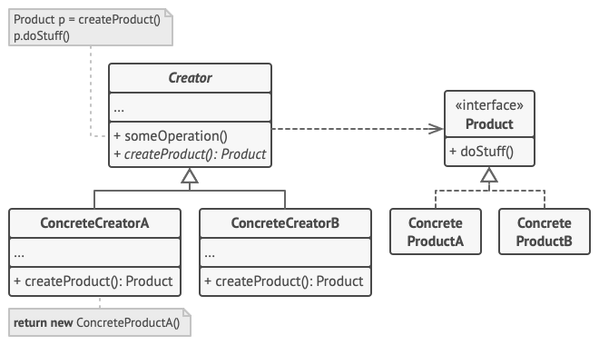

# Factory Method

> Factory Method is a creational design pattern that provides an interface for creating objects in a superclass,
> but allows subclasses to alter the type of objects that will be created.

- 직접 생성자를 호출하지 않고 팩토리 메서드를 통해 간접적으로 객체를 생성하는 방식이다.
- 부모 클래스(Abstract creator)는 팩토리 메서드에서 특정 인터페이스 타입(Abstract product)을 반환하도록 정의한다.
- 자식 클래스(Concrete creator)는 팩토리 메서드에서 Product 인터페이스를 구현하는 타입(Concrete product)을 반환하도록 재정의한다. 즉, 자식 클래스는 반환할 객체의 종류를 결정한다.
- 클라이언트 코드는 다양한 Product 객체의 실제 타입이나 구현내용을 알 필요가 없고 구현된 인터페이스를 이용하기만 하면 된다.
- Creator는 객체 생성기능 이외에도 관련된 비즈니스 로직을 포함할 수 있다.
- 팩토리 메서드에서 항상 객체를 생성하지 않고 오브젝트 풀링 등으로 기존에 생성된 객체를 반환하도록 구현할 수도 있다.

# Abstract Factory

> Abstract Factory is a creational design pattern that lets you produce families of related objects without specifying their concrete classes.

## Pros

- Single Responsibility Principle: 객체를 생성하는 코드와 사용하는 코드를 분리한다.
- Open/Closed Principle: 기존 코드의 수정 없이도 확장에 용이하다. ex) 새로운 product를 추가하고자 할 때 concrete creator를 추가하고 팩터리 메서드를 오버라이드하기만 하면 된다.
- Decoupling: client code와 concrete product 사이의 의존성이 감소한다.
- 서로 호환되지 않는 Product가 생성될 염려가 없다.[^abstract_factory_only]

## Cons

- 코드 복잡도가 증가한다.

## References

- [Refactoring Guru][reference_link_0]
- [QianMo github repo][reference_link_1]

[reference_link_0]: https://refactoring.guru/design-patterns/factory-method
[reference_link_1]: https://github.com/QianMo/Unity-Design-Pattern/blob/master/Assets/Creational%20Patterns/Factory%20Method%20Pattern/README.md

[^abstract_factory_only]: 추상 팩토리에만 해당함.
